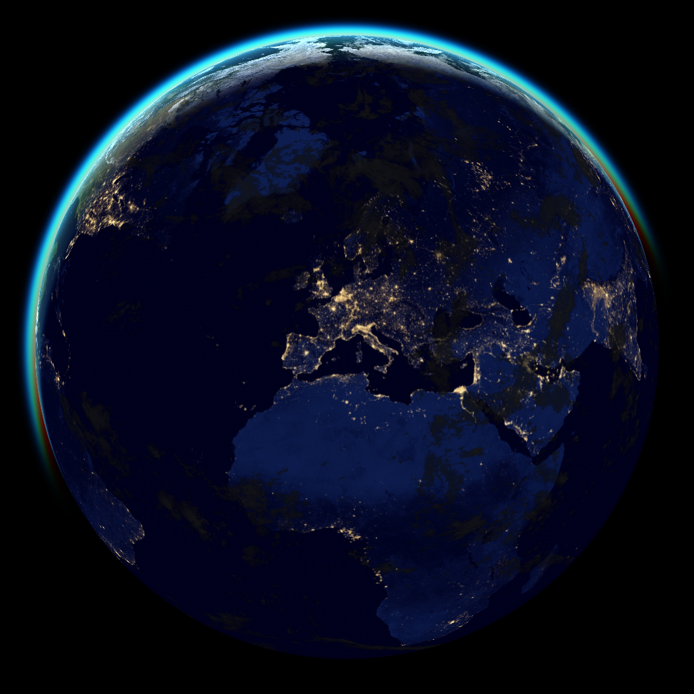

# xplanet-generator

generate cool shots of the Earth using Xplanet w/ curated resources & config



## tl:dr

_using docker:_
```
# clone and prep
git clone https://github.com/k0rventen/xplanet-generator.git
cd xplanet-generator
docker build -t xplanetgen .

# resulting images will be in ./out
docker run -v $PWD/out:/xplanet/out xplanetgen
```


## resources
- [The xplanet program](https://xplanet.sourceforge.net/)
- Earth `maps` from [NASA's Blue Marble](https://visibleearth.nasa.gov/collection/1484/blue-marble)
- the cloud rolling script uses [Python's Pillow library](https://pypi.org/project/Pillow/)
- the `rayleigh` folder is already generated in png format